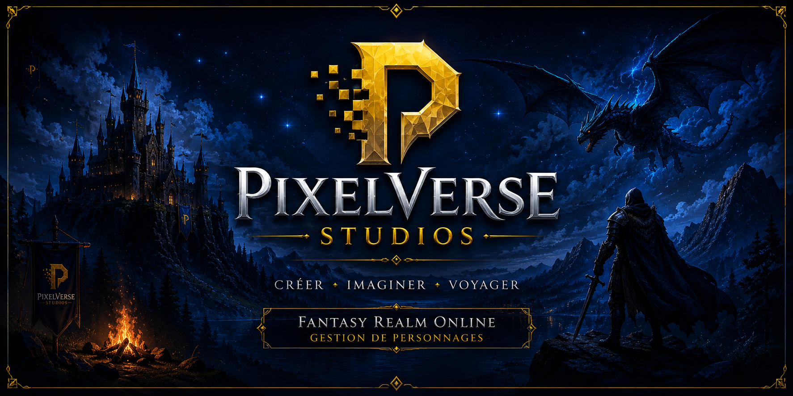

<p align="center">
  
</p>

# 🎮 PixelVerse Studios

<p align="center">
    <a href="https://developer.mozilla.org/fr/docs/Web/HTML">
        
    </a>
    <a href="https://developer.mozilla.org/fr/docs/Web/CSS">
        
    </a>
    <a href="https://sass-lang.com/documentation/">
        
    </a>
    <a href="https://developer.mozilla.org/fr/docs/Web/JavaScript">
        
    </a>
    <a href="https://getbootstrap.com/docs/5.3/getting-started/introduction/">
        
    </a>
    <a href="https://nodejs.org/docs/latest/api/">
        
    </a>
</p>

<p align="center">
    
    
</p>

Application web de gestion de personnages pour **Fantasy Realm Online**, un MMORPG imaginé par
**PixelVerse Studios**.

Ce projet permet aux joueurs de créer, consulter et gérer leurs personnages à travers une interface
moderne développée en **HTML**, **SCSS**, **Bootstrap** et **JavaScript**.

---

## 📚 Sommaire

- [📖 Présentation](#-présentation)
- [✨ Fonctionnalités](#-fonctionnalités)
- [🛠️ Technologies utilisées](#️-technologies-utilisées)
- [📂 Structure du projet](#-structure-du-projet)
- [📄 Pages disponibles](#-pages-disponibles)
- [🚀 Installation](#-installation)
- [▶️ Lancer le projet](#️-lancer-le-projet)
- [📦 Dépendances](#-dépendances)
- [🗂️ Architecture](#️-architecture)
- [🎨 Charte graphique](#-charte-graphique)
- [🎨 Objectif du projet](#-objectif-du-projet)
- [📸 Aperçu](#-aperçu)
- [🔮 Évolutions prévues](#-évolutions-prévues)
- [👨‍💻 Auteur](#-auteur)
- [📄 Licence](#-licence)

## 📖 Présentation

PixelVerse Studios est un projet de développement web ayant pour objectif de créer une plateforme
dédiée à la gestion des personnages du MMORPG **Fantasy Realm Online**.

L'application offre une navigation fluide grâce à un système de routage JavaScript et propose
plusieurs pages permettant aux utilisateurs de consulter leurs personnages, en créer de nouveaux et
gérer leur compte.

---

## ✨ Fonctionnalités

- 🏠 Page d'accueil
- 👤 Création de personnage
- 🖼️ Galerie des personnages
- 📋 Consultation des détails d'un personnage
- 📁 Gestion des personnages
- 🔐 Connexion utilisateur
- 📝 Création de compte
- 🔑 Mot de passe oublié
- 📬 Formulaire de contact
- 🚧 Gestion des erreurs (page 404)

---

## 🛠️ Technologies utilisées

### Front-end

- HTML5
- CSS3
- JavaScript ES6 (Modules)
- Bootstrap 5
- Bootstrap Icons

### Outils

- Node.js
- npm
- Docker Compose (configuration présente)
- Prettier

---

## 📂 Structure du projet

```text
PixelVerse-Studios/
│
├── html/
│   ├── index.html          # Point d'entrée de l'application
│   ├── accueil.html        # Présentation de PixelVerse Studios
│   ├── galerie.html        # Galerie des personnages
│   ├── detail.html         # Fiche détaillée d'un personnage
│   ├── create.html         # Création d'un personnage
│   ├── perso.html          # Gestion des personnages
│   ├── log.html            # Connexion
│   ├── register.html       # Création d'un compte
│   ├── password.html       # Mot de passe oublié
│   ├── contact.html        # Formulaire de contact
│   └── 404.html            # Page d'erreur
│
├── css/
│   ├── accueil.css
│   ├── galerie.css
│   ├── detail.css
│   ├── create.css
│   ├── perso.css
│   ├── log.css
│   └── contact.css
│
├── scss/
│   ├── main.scss           # Feuille de style principale
│   ├── _custom.scss        # Variables et personnalisations Bootstrap
│   ├── main.css            # CSS compilé
│   └── main.css.map        # Source map
│
├── Router/
│   ├── Route.js            # Définition d'une route
│   ├── router.js           # Gestionnaire de navigation
│   └── allRoutes.js        # Centralisation des routes
│
├── images/
│   ├── perso1.png
│   └── perso5.png
│
├── Personnages            # Données ou ressources des personnages
│
├── .vscode/
│   └── settings.json       # Configuration de Visual Studio Code
│
├── package.json            # Dépendances et scripts npm
├── package-lock.json       # Verrouillage des dépendances
├── docker-compose.yml      # Configuration Docker
├── .gitignore              # Fichiers ignorés par Git
├── .prettierrc             # Configuration de Prettier
├── launch.json             # Configuration de lancement
├── settings.json           # Paramètres du projet
├── Cas d'utilisation.drawio# Diagramme des cas d'utilisation
├── todo.txt                # Liste des tâches
└── README.md               # Documentation du projet
```

## 📁 Description des dossiers

### 📂 html/

Ce dossier contient toutes les pages de l'application. Chaque page correspond à une fonctionnalité
ou une vue spécifique accessible via le routeur JavaScript.

- **index.html** : point d'entrée de l'application.
- **accueil.html** : présentation du studio et du projet.
- **galerie.html** : affichage des personnages disponibles.
- **detail.html** : informations détaillées d'un personnage.
- **create.html** : création d'un personnage.
- **perso.html** : gestion des personnages de l'utilisateur.
- **log.html** : connexion.
- **register.html** : inscription.
- **password.html** : récupération du mot de passe.
- **contact.html** : formulaire de contact.
- **404.html** : page affichée lorsqu'une route est introuvable.

---

### 📂 css/

Regroupe les feuilles de style propres à chaque page du site afin de conserver une architecture
claire et modulaire.

Chaque page HTML possède son fichier CSS dédié.

---

### 📂 scss/

Contient les fichiers sources SCSS du projet.

- **main.scss** centralise les imports.
- **\_custom.scss** permet de personnaliser Bootstrap (couleurs, variables…).
- **main.css** est le fichier compilé utilisé par le navigateur.

L'utilisation de SCSS facilite la maintenance et l'évolution des styles.

---

### 📂 Router/

Implémente le système de routage de l'application.

- **Route.js** définit le modèle d'une route.
- **router.js** gère la navigation dynamique.
- **allRoutes.js** centralise l'ensemble des routes disponibles.

Cette architecture facilite l'ajout de nouvelles pages sans modifier le fonctionnement global de
l'application.

---

### 📂 images/

Contient les illustrations utilisées dans le projet, notamment les visuels des personnages.

---

### 📂 Data-Personnages/

Dossier destiné à regrouper les ressources liées aux personnages du MMORPG.

Il pourra accueillir à terme :

- portraits,
- statistiques,
- classes,
- équipements,
- données JSON.

---

### 📂 .vscode/

Configuration spécifique du projet pour Visual Studio Code.

Elle permet d'harmoniser l'environnement de développement entre les différents contributeurs.

---

## 📄 Fichiers principaux

| Fichier                      | Description                                        |
| ---------------------------- | -------------------------------------------------- |
| **package.json**             | Configuration du projet Node.js et des dépendances |
| **package-lock.json**        | Versionnement des dépendances                      |
| **docker-compose.yml**       | Configuration Docker                               |
| **.gitignore**               | Liste des fichiers ignorés par Git                 |
| **.prettierrc**              | Configuration du formateur Prettier                |
| **launch.json**              | Paramètres de lancement du projet                  |
| **settings.json**            | Configuration générale                             |
| **Cas d'utilisation.drawio** | Diagramme UML des cas d'utilisation                |
| **todo.txt**                 | Liste des fonctionnalités à développer             |
| **README.md**                | Documentation du projet                            |

---

## 📄 Pages disponibles

Les pages ci-dessous correspondent aux vues principales chargées par le routeur JavaScript. Elles
représentent les entrées de navigation disponibles dans l'application.

| Page                | Description                              |
| ------------------- | ---------------------------------------- |
| Accueil             | Présentation de PixelVerse Studios       |
| Galerie             | Affichage des personnages                |
| Mes personnages     | Gestion des personnages de l'utilisateur |
| Créer un personnage | Formulaire de création                   |
| Détail              | Informations complètes d'un personnage   |
| Connexion           | Authentification                         |
| Création de compte  | Inscription                              |
| Mot de passe oublié | Réinitialisation du mot de passe         |
| Contact             | Formulaire de contact                    |
| 404                 | Gestion des pages inexistantes           |

---

## 🚀 Installation

### Prérequis

- Node.js (version LTS recommandée)
- npm

### 1. Cloner le dépôt

```bash
git clone https://github.com/GrEg12oRi/PixelVerse-Studios.git
```

### 2. Accéder au projet

```bash
cd PixelVerse-Studios
```

### 3. Installer les dépendances

```bash
npm install
```

Cette commande installe notamment Bootstrap et Bootstrap Icons, qui sont déjà déclarés dans le
fichier [package.json](package.json).

Le projet ne nécessite pas d'étape de compilation avant exécution si vous utilisez uniquement les
fichiers HTML, CSS et JavaScript déjà présents.

---

## ▶️ Lancer le projet

Selon votre environnement, plusieurs possibilités :

### Avec un serveur local

Par exemple avec VS Code et l'extension **Live Server**, en ouvrant le fichier
[html/index.html](html/index.html).

ou

```bash
npx serve .
```

Puis ouvrez le projet dans votre navigateur. Si nécessaire, ciblez directement
[html/index.html](html/index.html).

---

## 📦 Dépendances

Le projet s'appuie sur deux bibliothèques front-end déclarées dans [package.json](package.json) :

- Bootstrap, pour la mise en page et les composants responsives
- Bootstrap Icons, pour les pictogrammes utilisés dans l'interface

Elles sont installées automatiquement avec la commande suivante :

```bash
npm install bootstrap bootstrap-icons
```

---

## 🗂️ Architecture

Le projet repose sur une structure de type page shell avec chargement dynamique du contenu.

Le point d'entrée principal est [html/index.html](html/index.html) : il contient la structure
globale de l'application et le conteneur dans lequel le routeur injecte les vues.

Le projet utilise un système de routage JavaScript situé dans :

```text
Router/router.js
```

Les routes sont centralisées dans :

```text
Router/allRoutes.js
```

Le routeur charge le contenu HTML correspondant à chaque page, met à jour le titre du navigateur et
gère la navigation sans rechargement complet de la page.

L'organisation des styles est séparée en deux niveaux :

- [scss/main.scss](scss/main.scss) pour les styles globaux et la base Bootstrap
- les fichiers du dossier [css/](css/) pour les styles spécifiques aux pages

Cette séparation facilite l'ajout de nouvelles vues et limite les effets de bord entre les pages.

---

## 📊 Diagramme des cas d'utilisation

Le diagramme ci-dessous présente les principales interactions entre les types d'utilisateurs et les
fonctionnalités de l'application.

<p align="center">
    
</p>

Ce diagramme met en évidence les fonctionnalités accessibles aux différetns types d'utilisateurs,
comme par exemple, les visiteurs:

- Inscription
- Connexion
- Consultation de la galerie des personnages

Les Utilisateurs peuvent donc avoir accès à ces fonctionnalités :

- Authentification
- Création et gestion de compte
- Gestion des personnages
- Consultation de la galerie des personnages
- Réalisation d'avis à propos des personnages

Ainsi, dans le cadre de leurs fonctions, les Employés sont responsables des actions suivantes :

- Gestion des commentaires, des comptes utilisateurs et des objets de personnalisation
- Administration des personnages
- Validation ou refus des noms de personnages

Enfin, en plus d'avoir accès aux fonctionnalités des employés, les Administrateurs ont de nombreuses
responsabilités :

- Gestion des comptes employés
- Suivi des modifications de personnages

---

## 🎨 Charte graphique

La charte graphique du projet repose sur un univers fantasy/gaming sobre, avec une identité visuelle
cohérente sur l'ensemble des pages.

### Palette de couleurs

- Bleu principal : `#003366`
- Doré secondaire : `#CCAC00`
- Jaune accent : `#FFDD00`
- Fond principal : `#CCAC00`
- Fond léger : `rgba(194, 142, 0, 0.1)`
- Surface claire : `#E0E0E0`
- Surface chaude : `#F7F0DC`
- Texte principal : `#0F2442`

### Variables de thème

- `--pv-primary`, `--pv-secondary` et `--pv-accent` portent la palette principale
- `--pv-surface`, `--pv-surface-soft` et `--pv-surface-strong` gèrent les fonds et panneaux
- `--pv-shadow` et `--pv-radius` gèrent la profondeur et les arrondis
- `--pv-font-ui` et `--pv-font-text` définissent la hiérarchie typographique

### Typographies

- Titres et interface : `Montserrat`
- Textes courants : `Mooli`

### Composants communs

- Barre de navigation sombre avec survol doré
- Liens et boutons orientés vers les couleurs de la marque
- Footer cohérent avec le header
- Paragraphes plus lisibles grâce à une police sérif légère

### Direction visuelle

L'ambiance vise un rendu fantasy premium: fond global en dégradé, aplats bleu nuit, accents dorés,
surfaces crème, cartes arrondies et ombres douces pour donner plus de profondeur sans alourdir
l'interface.

### Fichiers de référence

- [scss/\_custom.scss](scss/_custom.scss) centralise les variables Bootstrap et la palette
- [scss/main.scss](scss/main.scss) applique les styles globaux du site
- [html/index.html](html/index.html) contient le layout commun avec header et footer

### Règle de maintenance

Pour garder une charte propre, il faut éviter de répéter les mêmes couleurs dans chaque fichier CSS
de page. Les fichiers comme `accueil.css` ou `contact.css` doivent surtout gérer la mise en page
spécifique, tandis que les éléments communs doivent rester dans le SCSS principal.

## 🎯 Objectif du projet

L'objectif est de proposer une interface immersive et claire permettant aux joueurs de **Fantasy
Realm Online** de gérer facilement leurs personnages et d'accéder rapidement aux principales
fonctionnalités du site.

Le projet met en pratique plusieurs notions de développement front-end :

- l'organisation d'un projet web structuré
- la navigation via un routeur JavaScript
- une interface responsive avec Bootstrap
- la séparation des responsabilités entre HTML, CSS/SCSS et JavaScript
- la gestion de vues chargées dynamiquement

---

## 📸 Aperçu

Cette section rassemble les principales vues de l'application telles qu'elles apparaissent dans le
projet. Les captures permettent de visualiser le parcours utilisateur complet, depuis la page
d'accueil jusqu'aux écrans de création, consultation et gestion du compte.

### Accueil

La page d'accueil présente le studio, le jeu et l'accès rapide vers la création de personnage.

<p align="center">
    
</p>
<p align="center">
    
</p>

### Galerie des personnages

Cette vue affiche les personnages disponibles avec les filtres de recherche et les cartes de
personnages générées par la galerie.

<p align="center">
    
</p>
<p align="center">
    
</p>

### Création de personnage

L'écran de création permet de saisir un pseudo, choisir un genre et lancer la génération du
personnage.

<p align="center">
    
</p>

### Détails du personnage

Les captures ci-dessous montrent la fiche détaillée d'un personnage avec ses informations,
statistiques, équipements et commentaires.

<p align="center">
    
</p>

<p align="center">
    
</p>

### Contact

Le formulaire de contact regroupe les informations utilisateur, le sujet de la demande et le message
à envoyer.

<p align="center">
    
</p>
<p align="center">
    
</p>

### Connexion et compte

Ces écrans couvrent la connexion, la création de compte et la réinitialisation du mot de passe.

<p align="center">
    
</p>

<p align="center">
    
</p>

<p align="center">
    
</p>

---

## 🔮 Évolutions prévues

Les évolutions prévues servent de feuille de route pour enrichir l'application :

- Authentification complète
- Sauvegarde en base de données
- API REST
- Gestion des classes et races
- Gestion des objets de personnalisation
- Statistiques des personnages
- Tableau de bord utilisateur
- Administration

---

## 👨‍💻 Auteur

**Bruna Grégori**

Projet réalisé dans le cadre d'une formation Développeur Web.

GitHub : <https://github.com/GrEg12oRi>

---

## 📄 Licence

Projet distribué à des fins pédagogiques.

Tous les droits concernant l'univers **Fantasy Realm Online** et **PixelVerse Studios** sont
réservés à leur créateur. Toute reproduction ou réutilisation nécessite l'autorisation préalable de
l'auteur.
